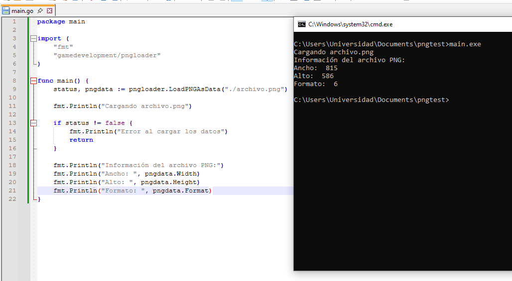

# PNGLoader

 Cargador de archivos PNG para el lenguaje de programación Go. Para utilizar, debe importar la biblioteca y llamar la siguiente función:

```
LoadPNGAsData(filename string)
```

## Características

- Permite cargar archivos PNG con interlacing y compresión ZLIB
- Soporta archivos PNG con canales alpha
- Permite cargar todo el archivo como un arreglo de bytes, facilitando tareas de computación gráfica

## Stack

- Lenguaje de programación Go

## Arquitectura

- El software se divide en dos módulos principalmente: loader y parser.
 - Loader es el encargado de entregarle al usuario el archivo ya cargado
 - Parser es el encargado de procesar el archivo PNG, descomprimirlo, tratar el interlacing, etc.

## Screenshots


